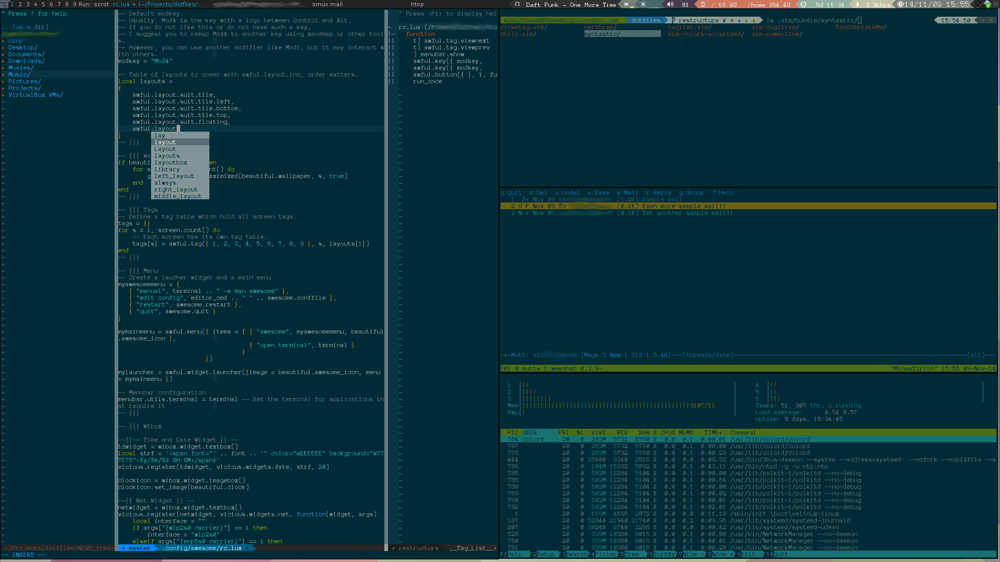

Stephen Haffner's Dotfiles
==========================

This is my collection of homefolder config files. Feel free to use, modifify, and redistribute any configs that you like.

Included configs
----------------

- :doc:`vim <doc/vim>`
- zsh (Documentation in progress)
- :doc:`Mutt mail client <doc/mutt>`
- :doc:`Awesome WM <doc/awesome>`
- Urxvt & Xresources & Fonts (Documention in progress)
- More in the future...

Planned configs
---------------
- Autossh+tmux
- mpd

Install Notes
-------------

This repository includes a lot of submodules. In order to clone everthing needed to make this set of configurations work you need to run ``git clone --recursive https://github.com/kd8zev/dotfiles.git``

There are a series of installed located in the installers folder. There will be a complete install script in the future. **These scripts are mostly untested!! Use at your own risk!!**

Screenshot
----------

